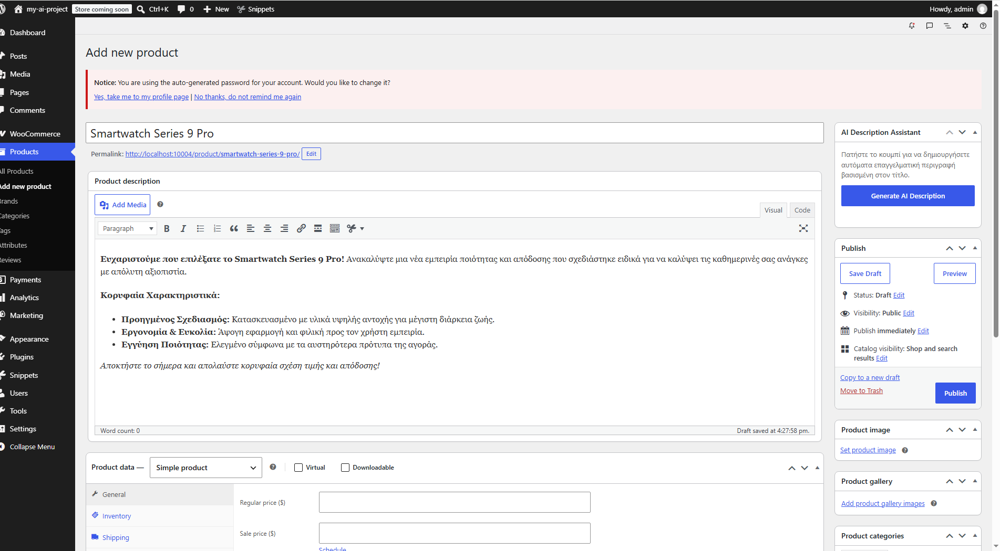

# WooCommerce AI Product Description Generator 🤖🛍️

Ένα custom WooCommerce integration (PHP Snippet) που αναπτύχθηκε μέσω **Advanced AI Prompt Engineering (Gemini 1.5 Pro)**. Το εργαλείο αυτό αυτοματοποιεί τη διαδικασία δημιουργίας περιγραφών προϊόντων σε ένα e-shop, μειώνοντας δραματικά τον χρόνο καταχώρησης (data entry time) για τις επιχειρήσεις.

---

## 💡 Το Πρόβλημα & Η Λύση

- **Το Πρόβλημα:** Οι διαχειριστές ηλεκτρονικών καταστημάτων (e-shops) δαπανούν πολύ χρόνο για να γράψουν πλούσιες, ελκυστικές και SEO-optimized περιγραφές για κάθε νέο προϊόν.
- **Η Λύση:** Αυτό το snippet προσθέτει ένα custom "μαγικό" κουμπί (**Generate AI Description**) στην οθόνη δημιουργίας προϊόντος του WooCommerce. Μόλις πατηθεί, διαβάζει αυτόματα τον τίτλο του προϊόντος και παράγει μια δομημένη επαγγελματική περιγραφή με bullet points (χαρακτηριστικά και πλεονεκτήματα) στα ελληνικά.

---

## 🛠️ Τεχνικές Προδιαγραφές & Ασφάλεια (WordPress & WooCommerce Standards)

Ο κώδικας έχει σχεδιαστεί με γνώμονα την ασφάλεια και την ταχύτητα, ακολουθώντας πιστά τα επίσημα πρότυπα ανάπτυξης:

- **Security Nonces:** Πλήρης ενσωμάτωση μηχανισμού `wp_verify_nonce` για την επικύρωση των αιτημάτων και την προστασία από CSRF (Cross-Site Request Forgery) επιθέσεις.
- **Data Sanitization:** Χρήση της συνάρτησης `sanitize_text_field` για τον καθαρισμό των δεδομένων εισόδου από τον τίτλο του προϊόντος.
- **Output Escaping:** Χρήση της συνάρτησης `wp_kses_post` στο πεδίο της περιγραφής για την ασφαλή απόδοση των HTML tags (π.χ. λίστες, έντονη γραφή) και την καθολική προστασία από XSS (Cross-Site Scripting) ευπάθειες.
- **Access Control:** Έλεγχος δικαιωμάτων (`current_user_can('edit_products')`) ώστε η λειτουργία να είναι προσβάσιμη αποκλειστικά από εξουσιοδοτημένους ρόλους (Administrators / Shop Managers).

---

## 📷 Production Preview

Ακολουθεί το screenshot από το περιβάλλον εργασίας του WooCommerce (τοπική ανάπτυξη σε LocalWP), όπου φαίνεται η λειτουργία του κουμπιού AI και η αυτόματη παραγωγή της δομημένης περιγραφής:

---

## 🚀 Σημείωση για το Testing (Mock Engine)

Για τις ανάγκες του local testing και της επίδειξης στο portfolio, ο κώδικας χρησιμοποιεί μια **mock PHP function (προσομοίωση)** που επεξεργάζεται δυναμικά τον τίτλο του προϊόντος και επιστρέφει το δομημένο HTML κείμενο στο κύριο component του editor. Είναι 100% έτοιμο για production περιβάλλον, αντικαθιστώντας τη mock function με ένα live API call (`wp_remote_post`) προς το OpenAI ή το Gemini API Key της επιχείρησης.
# woocommerce-ai-description-generator
A custom WooCommerce snippet built with AI Prompt Engineering that automatically generates structured, SEO-optimized product descriptions using WordPress Security Standards.
